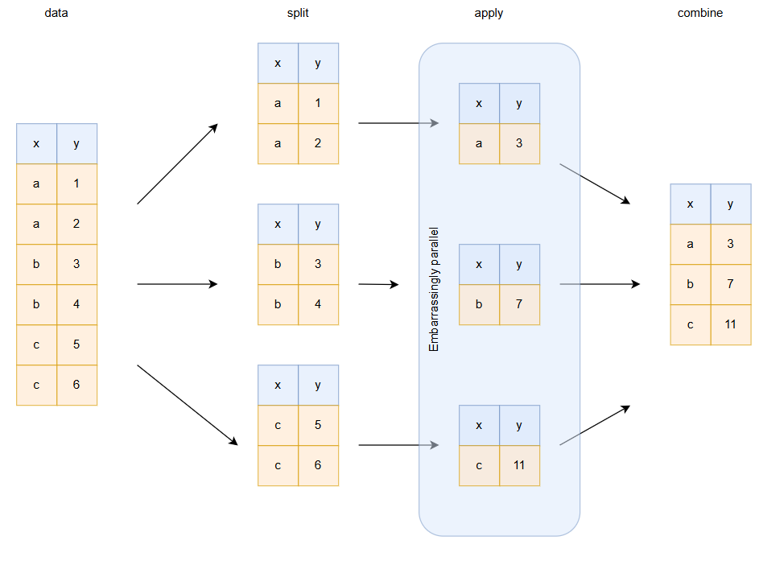

# Getting-started-with-Polars
A beginner-friendly guide to getting started with Polars in Python, featuring examples of efficient data manipulation, analysis, and comparisons with Pandas.

## Introduction to Polars

[Polars](https://pola-rs.github.io/polars-book/) is a high-performance DataFrame library designed for Python and Rust. It is optimized for processing large datasets with lightning-fast speed and minimal memory usage. Polars leverages Rust's efficient multi-threaded execution and zero-copy memory management to outperform traditional DataFrame libraries like Pandas in many scenarios.

### Key Features
- **Lightning-Fast Performance:** Built with Rust, Polars takes advantage of parallelization and vectorized operations to handle millions of rows efficiently.
- **Lazy Execution:** Polars supports lazy computation, enabling query optimization and faster execution for complex workflows.
- **Versatility:** It provides support for a variety of data operations, including filtering, grouping, aggregating, and joining.
- **Memory Efficiency:** Polars minimizes memory overhead through zero-copy data structures and out-of-core computations.
- **Expressive Syntax:** Polars offers both a Pandas-like API and a more advanced query language, making it accessible for beginners and powerful for advanced users.

Polars is an excellent choice for data engineers and scientists who need to process and analyze data at scale, all while enjoying modern, expressive, and efficient APIs.

---

For more information, visit the [official Polars documentation](https://pola-rs.github.io/polars-book/).

